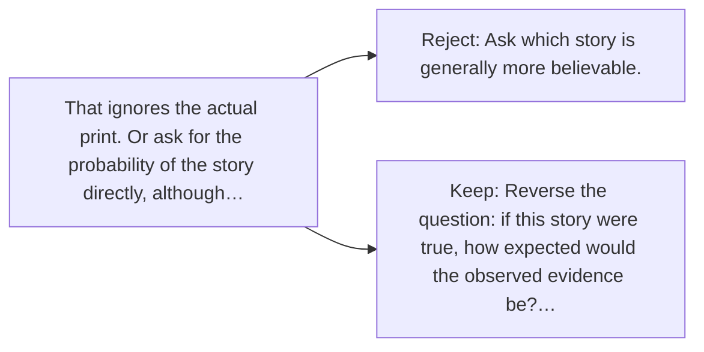

# Diagram — Excavation 018 — Likelihood — Which Hidden Story Produced This Evidence?

The picture carries this excavation's particular counterexample and repair.



```text
TRY     Ask which story is generally more believable.
BREAK   That ignores the actual print. Or ask for the probability of the story directly, although…
REPAIR  Reverse the question: if this story were true, how expected would the observed evidence be?…
```
