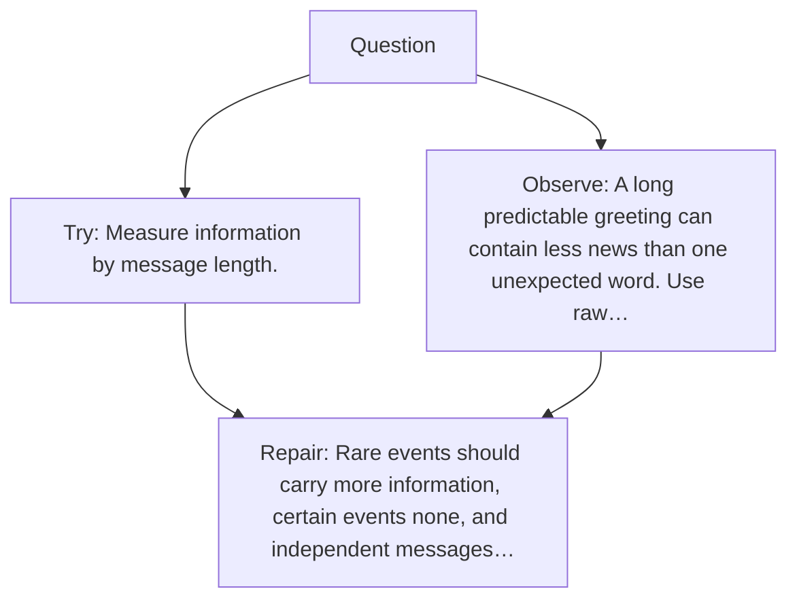

# Diagram — Excavation 019 — Information — Why Surprise Needs a Number

The picture carries this excavation's particular counterexample and repair.



```text
TRY     Measure information by message length.
BREAK   A long predictable greeting can contain less news than one unexpected word. Use raw…
REPAIR  Rare events should carry more information, certain events none, and independent messages…
```

<!-- memory-film-v1:start -->
## Five-frame memory film

```text
QUESTION       Why Surprise Needs a Number?
     ↓
OBJECT         the information lantern mounted on the ring of glass lanterns
     ↓
VISIBLE BREAK  The lantern follows the tempting path—measure information by message length. Then the evidence answers: a long predictable greeting can contain less news than one unexpected word. Use raw surprise such as one divided by probability, but independent surprises then multiply instead of add.
     ↓
TRANSFORMATION The keeper of uncertain stories changes one moving part. The lantern can now rare events to carry more information, certain events to carry none, and independent messages to add. The negative logarithm satisfies all three needs.
     ↓
MEMORY SEAL    Information keeps the missing power: rare events to carry more information, certain events to carry none, and independent messages to add. The negative logarithm satisfies all three needs.
```
<!-- memory-film-v1:end -->
