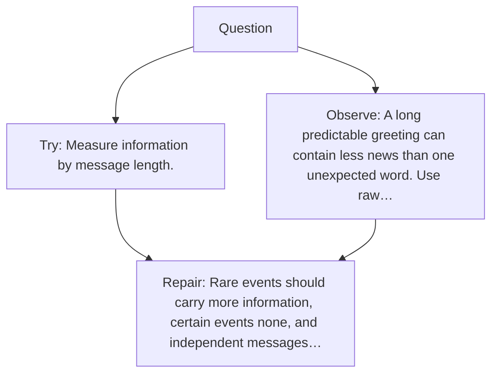

# Diagram — Excavation 019 — Information — Why Surprise Needs a Number

The picture carries this excavation's particular counterexample and repair.



```text
TRY     Measure information by message length.
BREAK   A long predictable greeting can contain less news than one unexpected word. Use raw…
REPAIR  Rare events should carry more information, certain events none, and independent messages…
```
