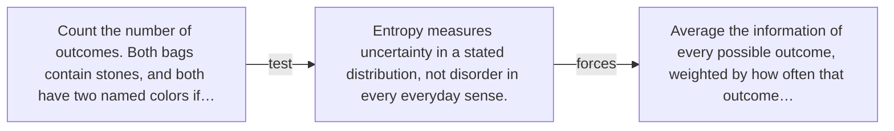

# Diagram — Excavation 020 — Entropy — Measuring the Uncertainty of a Whole Situation

The picture carries this excavation's particular counterexample and repair.



```text
TRY     Count the number of outcomes. Both bags contain stones, and both have two named colors if…
BREAK   Entropy measures uncertainty in a stated distribution, not disorder in every everyday sense.
REPAIR  Average the information of every possible outcome, weighted by how often that outcome…
```
