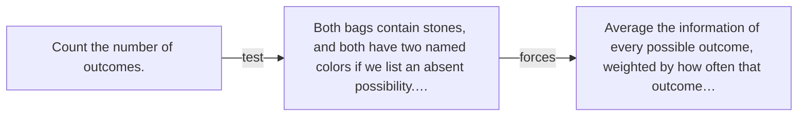

# Diagram — Excavation 020 — Entropy — Measuring the Uncertainty of a Whole Situation

The picture carries this excavation's particular counterexample and repair.



```text
TRY     Count the number of outcomes.
BREAK   Both bags contain stones, and both have two named colors if we list an absent possibility.…
REPAIR  Average the information of every possible outcome, weighted by how often that outcome…
```

<!-- memory-film-v1:start -->
## Five-frame memory film

```text
QUESTION       What fails if we count the number of outcomes?
     ↓
OBJECT         the entropy compass mounted on the ring of glass lanterns
     ↓
VISIBLE BREAK  The compass follows the tempting path—count the number of outcomes. Then the evidence answers: both bags contain stones, and both have two named colors if we list an absent possibility. Or inspect only the most likely outcome, losing the rest of the distribution.
     ↓
TRANSFORMATION The keeper of uncertain stories changes one moving part. The compass can now average the information of every possible outcome, weighted by how often that outcome occurs.
     ↓
MEMORY SEAL    Entropy keeps the missing power: average the information of every possible outcome, weighted by how often that outcome occurs.
```
<!-- memory-film-v1:end -->
