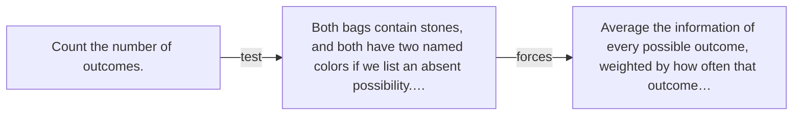

# Diagram — Excavation 020 — Entropy — Measuring the Uncertainty of a Whole Situation

The picture carries this excavation's particular counterexample and repair.



```text
TRY     Count the number of outcomes.
BREAK   Both bags contain stones, and both have two named colors if we list an absent possibility.…
REPAIR  Average the information of every possible outcome, weighted by how often that outcome…
```
