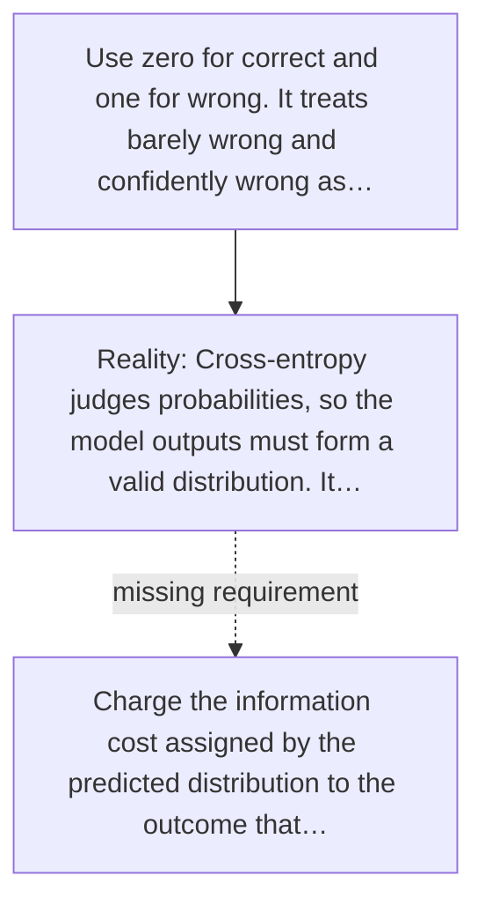

# Diagram — Excavation 021 — Cross-Entropy — Paying for Confidently Wrong Predictions

The picture carries this excavation's particular counterexample and repair.



```text
TRY     Use zero for correct and one for wrong. It treats barely wrong and confidently wrong as…
BREAK   Cross-entropy judges probabilities, so the model outputs must form a valid distribution. It…
REPAIR  Charge the information cost assigned by the predicted distribution to the outcome that…
```
