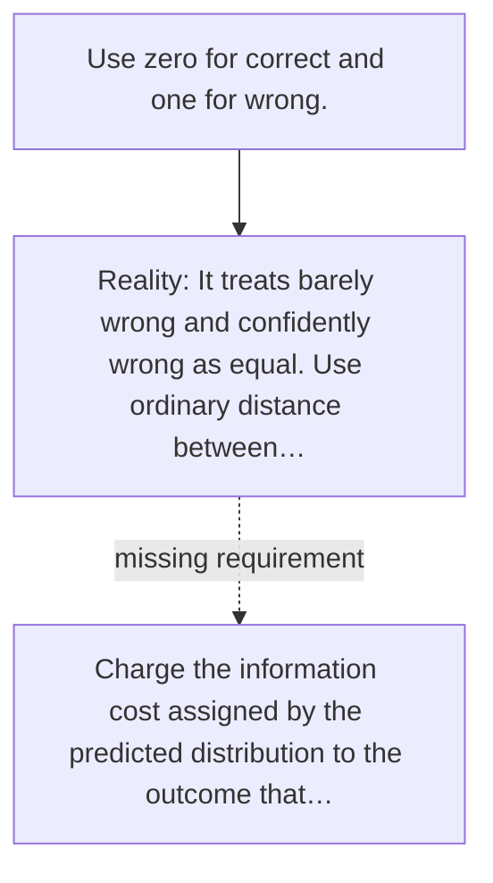

# Diagram — Excavation 021 — Cross-Entropy — Paying for Confidently Wrong Predictions

The picture carries this excavation's particular counterexample and repair.



```text
TRY     Use zero for correct and one for wrong.
BREAK   It treats barely wrong and confidently wrong as equal. Use ordinary distance between…
REPAIR  Charge the information cost assigned by the predicted distribution to the outcome that…
```
