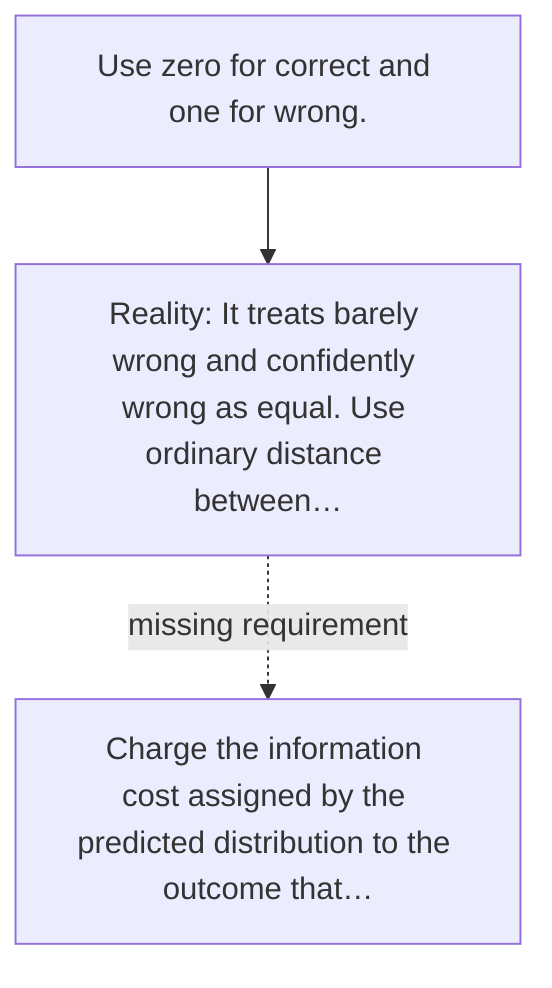

# Diagram — Excavation 021 — Cross-Entropy — Paying for Confidently Wrong Predictions

The picture carries this excavation's particular counterexample and repair.



```text
TRY     Use zero for correct and one for wrong.
BREAK   It treats barely wrong and confidently wrong as equal. Use ordinary distance between…
REPAIR  Charge the information cost assigned by the predicted distribution to the outcome that…
```

<!-- memory-film-v1:start -->
## Five-frame memory film

```text
QUESTION       What fails if we use zero for correct and one for wrong?
     ↓
OBJECT         the cross-entropy bridge mounted on the ring of glass lanterns
     ↓
VISIBLE BREAK  The bridge follows the tempting path—use zero for correct and one for wrong. Then the evidence answers: it treats barely wrong and confidently wrong as equal. Use ordinary distance between probabilities; it does not directly price the information wasted by the prediction.
     ↓
TRANSFORMATION The keeper of uncertain stories changes one moving part. The bridge can now charge the information cost assigned by the predicted distribution to the outcome that actually occurred.
     ↓
MEMORY SEAL    Cross-Entropy keeps the missing power: charge the information cost assigned by the predicted distribution to the outcome that actually occurred.
```
<!-- memory-film-v1:end -->
