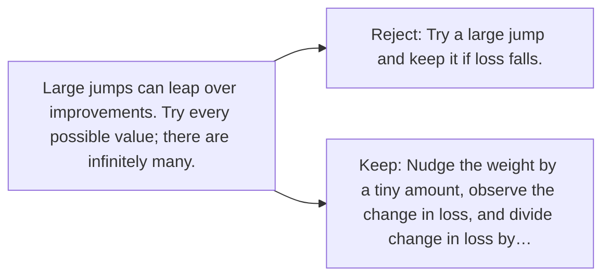

# Diagram — Excavation 022 — Derivatives — Asking One Weight What It Changed

The picture carries this excavation's particular counterexample and repair.



```text
TRY     Try a large jump and keep it if loss falls.
BREAK   Large jumps can leap over improvements. Try every possible value; there are infinitely many.
REPAIR  Nudge the weight by a tiny amount, observe the change in loss, and divide change in loss by…
```

<!-- memory-film-v1:start -->
## Five-frame memory film

```text
QUESTION       What fails if we try a large jump and keep it if loss falls?
     ↓
OBJECT         the derivatives thread mounted on the ring of glass lanterns
     ↓
VISIBLE BREAK  The thread follows the tempting path—try a large jump and keep it if loss falls. Then the evidence answers: large jumps can leap over improvements. Try every possible value; there are infinitely many.
     ↓
TRANSFORMATION The keeper of uncertain stories changes one moving part. The thread can now nudge the weight by a tiny amount, observe the change in loss, and divide change in loss by change in weight. Then imagine the nudge shrinking toward zero.
     ↓
MEMORY SEAL    Derivatives keeps the missing power: nudge the weight by a tiny amount, observe the change in loss, and divide change in loss by change in weight. Then imagine the nudge shrinking toward zero.
```
<!-- memory-film-v1:end -->
