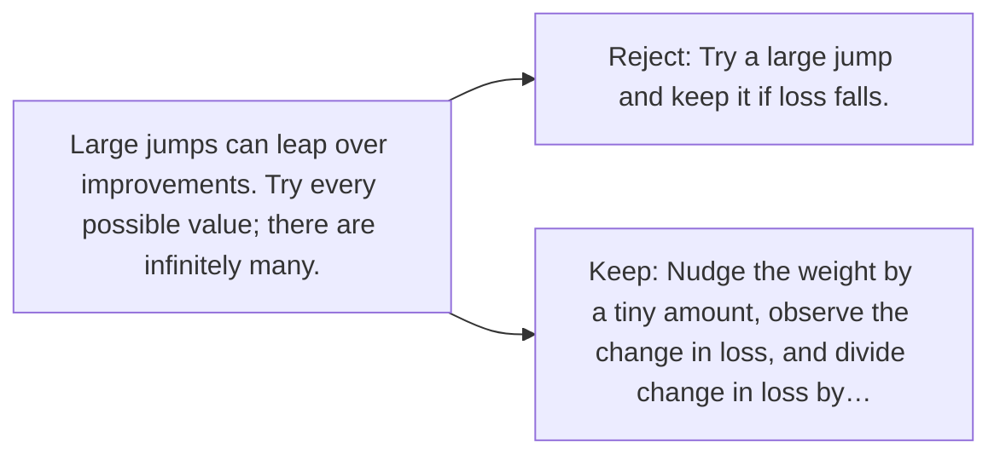

# Diagram — Excavation 022 — Derivatives — Asking One Weight What It Changed

The picture carries this excavation's particular counterexample and repair.



```text
TRY     Try a large jump and keep it if loss falls.
BREAK   Large jumps can leap over improvements. Try every possible value; there are infinitely many.
REPAIR  Nudge the weight by a tiny amount, observe the change in loss, and divide change in loss by…
```
