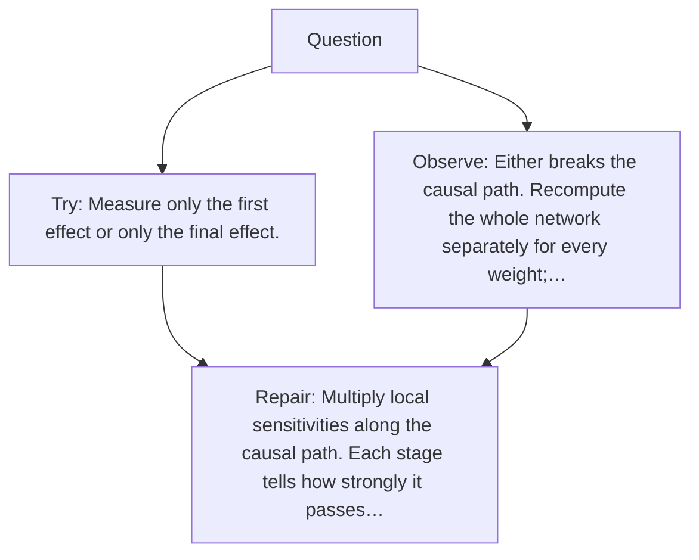

# Diagram — Excavation 023 — The Chain Rule — Following One Change Through Many Machines

The picture carries this excavation's particular counterexample and repair.



```text
TRY     Measure only the first effect or only the final effect.
BREAK   Either breaks the causal path. Recompute the whole network separately for every weight;…
REPAIR  Multiply local sensitivities along the causal path. Each stage tells how strongly it passes…
```

<!-- memory-film-v1:start -->
## Five-frame memory film

```text
QUESTION       What fails if we measure only the first effect or only the final effect?
     ↓
OBJECT         the chain rule mirror mounted on the ring of glass lanterns
     ↓
VISIBLE BREAK  The mirror follows the tempting path—measure only the first effect or only the final effect. Then the evidence answers: either breaks the causal path. Recompute the whole network separately for every weight; that repeats enormous amounts of work.
     ↓
TRANSFORMATION The keeper of uncertain stories changes one moving part. The mirror can now multiply local sensitivities along the causal path. Each stage tells how strongly it passes a small change onward.
     ↓
MEMORY SEAL    The Chain Rule keeps the missing power: multiply local sensitivities along the causal path. Each stage tells how strongly it passes a small change onward.
```
<!-- memory-film-v1:end -->
