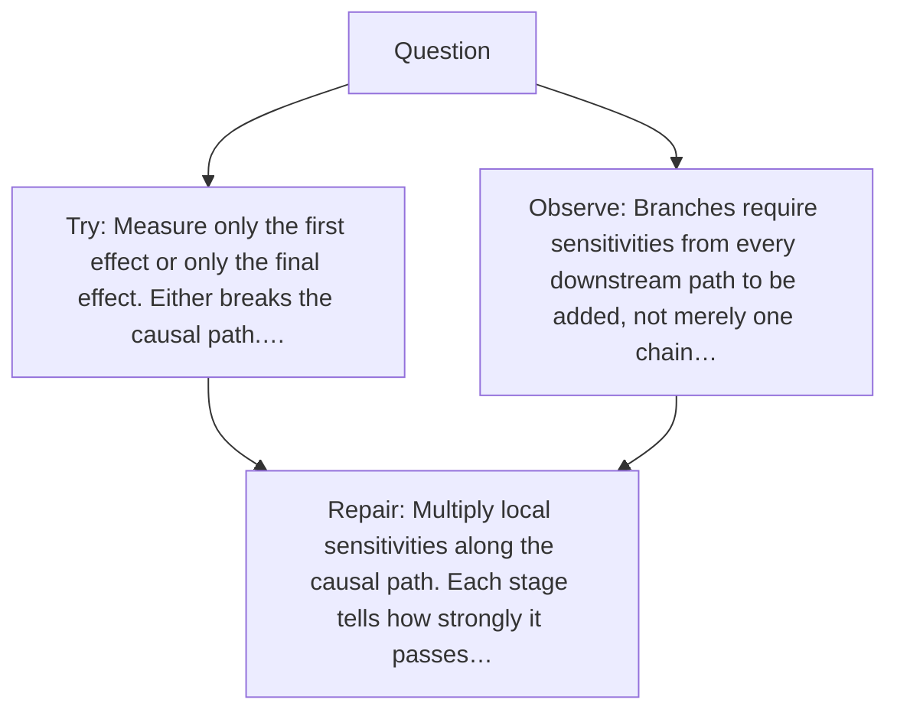

# Diagram — Excavation 023 — The Chain Rule — Following One Change Through Many Machines

The picture carries this excavation's particular counterexample and repair.



```text
TRY     Measure only the first effect or only the final effect. Either breaks the causal path.…
BREAK   Branches require sensitivities from every downstream path to be added, not merely one chain…
REPAIR  Multiply local sensitivities along the causal path. Each stage tells how strongly it passes…
```
