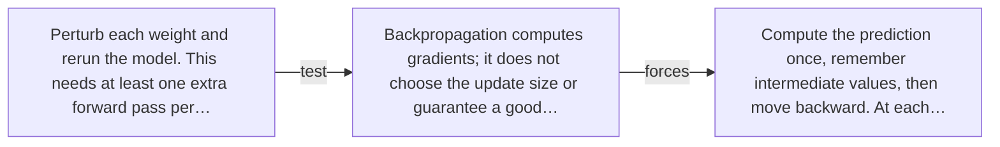

# Diagram — Excavation 024 — Backpropagation — Reusing Blame Instead of Recomputing It

The picture carries this excavation's particular counterexample and repair.



```text
TRY     Perturb each weight and rerun the model. This needs at least one extra forward pass per…
BREAK   Backpropagation computes gradients; it does not choose the update size or guarantee a good…
REPAIR  Compute the prediction once, remember intermediate values, then move backward. At each…
```
