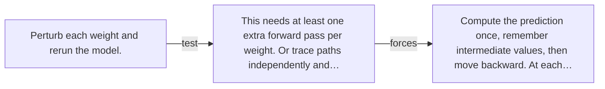

# Diagram — Excavation 024 — Backpropagation — Reusing Blame Instead of Recomputing It

The picture carries this excavation's particular counterexample and repair.



```text
TRY     Perturb each weight and rerun the model.
BREAK   This needs at least one extra forward pass per weight. Or trace paths independently and…
REPAIR  Compute the prediction once, remember intermediate values, then move backward. At each…
```
