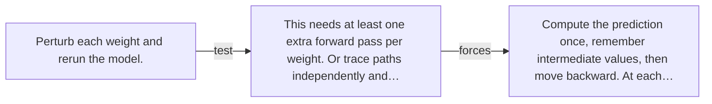

# Diagram — Excavation 024 — Backpropagation — Reusing Blame Instead of Recomputing It

The picture carries this excavation's particular counterexample and repair.



```text
TRY     Perturb each weight and rerun the model.
BREAK   This needs at least one extra forward pass per weight. Or trace paths independently and…
REPAIR  Compute the prediction once, remember intermediate values, then move backward. At each…
```

<!-- memory-film-v1:start -->
## Five-frame memory film

```text
QUESTION       What fails if we perturb each weight and rerun the model?
     ↓
OBJECT         the backpropagation bell mounted on the ring of glass lanterns
     ↓
VISIBLE BREAK  The bell follows the tempting path—perturb each weight and rerun the model. Then the evidence answers: this needs at least one extra forward pass per weight. Or trace paths independently and calculate the same suffix again and again.
     ↓
TRANSFORMATION The keeper of uncertain stories changes one moving part. The bell can now compute the prediction once, remember intermediate values, then move backward. At each node, reuse the blame already accumulated from everything downstream.
     ↓
MEMORY SEAL    Backpropagation keeps the missing power: compute the prediction once, remember intermediate values, then move backward. At each node, reuse the blame already accumulated from everything downstream.
```
<!-- memory-film-v1:end -->
