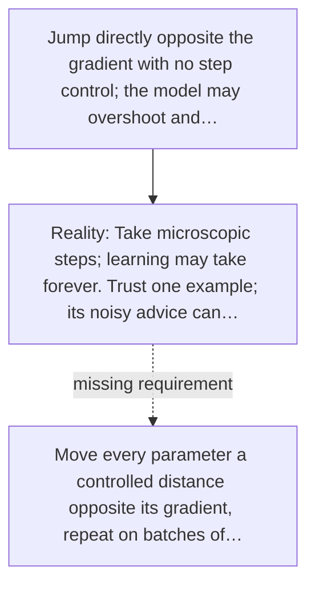

# Diagram — Excavation 025 — Gradient Descent — Teaching a Tiny Network

The picture carries this excavation's particular counterexample and repair.



```text
TRY     Jump directly opposite the gradient with no step control; the model may overshoot and…
BREAK   Take microscopic steps; learning may take forever. Trust one example; its noisy advice can…
REPAIR  Move every parameter a controlled distance opposite its gradient, repeat on batches of…
```
