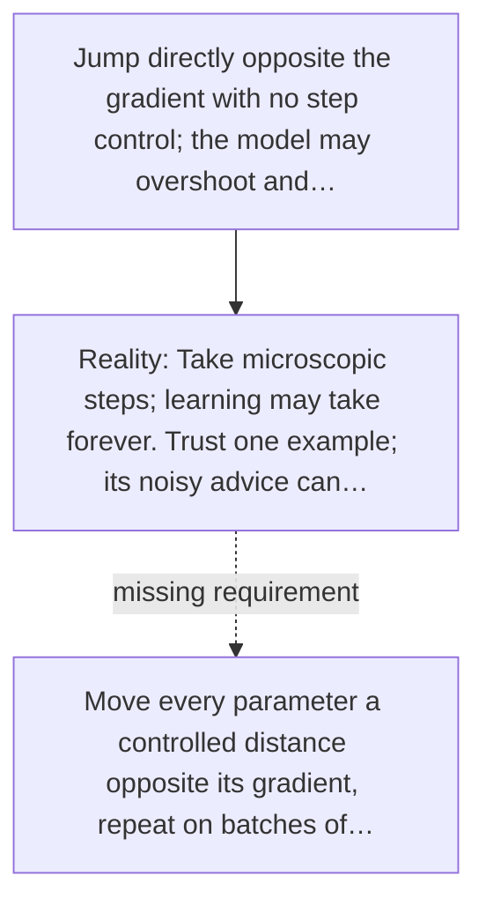

# Diagram — Excavation 025 — Gradient Descent — Teaching a Tiny Network

The picture carries this excavation's particular counterexample and repair.



```text
TRY     Jump directly opposite the gradient with no step control; the model may overshoot and…
BREAK   Take microscopic steps; learning may take forever. Trust one example; its noisy advice can…
REPAIR  Move every parameter a controlled distance opposite its gradient, repeat on batches of…
```

<!-- memory-film-v1:start -->
## Five-frame memory film

```text
QUESTION       What fails if we jump directly opposite the gradient with no step control; the model may overshoot and diverge?
     ↓
OBJECT         the gradient descent vessel mounted on the ring of glass lanterns
     ↓
VISIBLE BREAK  The vessel follows the tempting path—jump directly opposite the gradient with no step control; the model may overshoot and diverge. Then the evidence answers: take microscopic steps; learning may take forever. Trust one example; its noisy advice can undo another.
     ↓
TRANSFORMATION The keeper of uncertain stories changes one moving part. The vessel can now move every parameter a controlled distance opposite its gradient, repeat on batches of examples, and watch loss rather than assuming progress.
     ↓
MEMORY SEAL    Gradient Descent keeps the missing power: move every parameter a controlled distance opposite its gradient, repeat on batches of examples, and watch loss rather than assuming progress.
```
<!-- memory-film-v1:end -->
