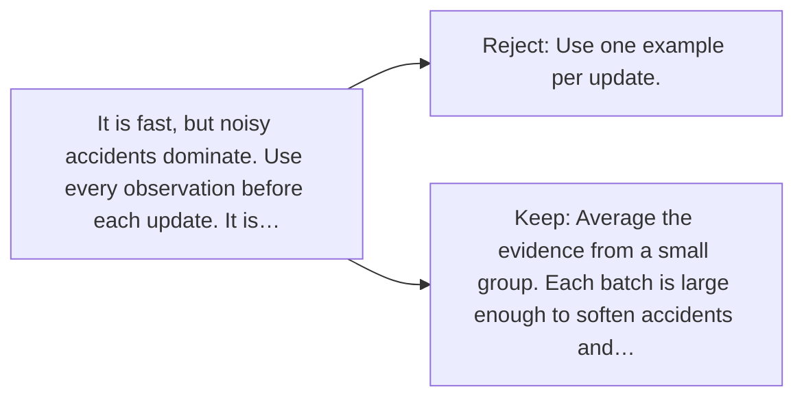

# Diagram — Excavation 026 — Mini-Batches — Learning from More Than One Example

The picture carries this excavation's particular counterexample and repair.



```text
TRY     Use one example per update.
BREAK   It is fast, but noisy accidents dominate. Use every observation before each update. It is…
REPAIR  Average the evidence from a small group. Each batch is large enough to soften accidents and…
```

<!-- memory-film-v1:start -->
## Five-frame memory film

```text
QUESTION       What fails if we use one example per update?
     ↓
OBJECT         the mini-batches gate mounted on the ring of glass lanterns
     ↓
VISIBLE BREAK  The gate follows the tempting path—use one example per update. Then the evidence answers: it is fast, but noisy accidents dominate. Use every observation before each update. It is stable, but painfully slow and cannot react until the whole archive is read.
     ↓
TRANSFORMATION The keeper of uncertain stories changes one moving part. The gate can now average the evidence from a small group. Each batch is large enough to soften accidents and small enough to update frequently.
     ↓
MEMORY SEAL    Mini-Batches keeps the missing power: average the evidence from a small group. Each batch is large enough to soften accidents and small enough to update frequently.
```
<!-- memory-film-v1:end -->
