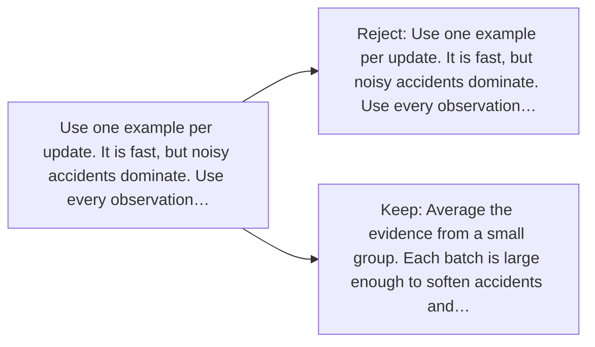

# Diagram — Excavation 026 — Mini-Batches — Learning from More Than One Example

The picture carries this excavation's particular counterexample and repair.



```text
TRY     Use one example per update. It is fast, but noisy accidents dominate. Use every observation…
BREAK   Use one example per update. It is fast, but noisy accidents dominate. Use every observation…
REPAIR  Average the evidence from a small group. Each batch is large enough to soften accidents and…
```
