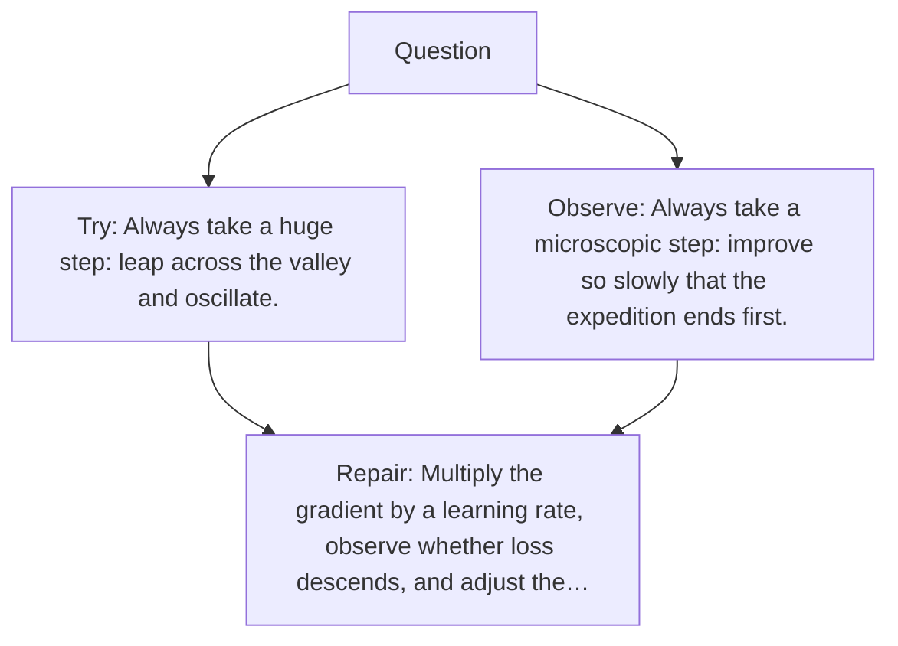

# Diagram — Excavation 027 — Learning Rate — How Large Should the Next Step Be?

The picture carries this excavation's particular counterexample and repair.



```text
TRY     Always take a huge step: leap across the valley and oscillate.
BREAK   Always take a microscopic step: improve so slowly that the expedition ends first.
REPAIR  Multiply the gradient by a learning rate, observe whether loss descends, and adjust the…
```
