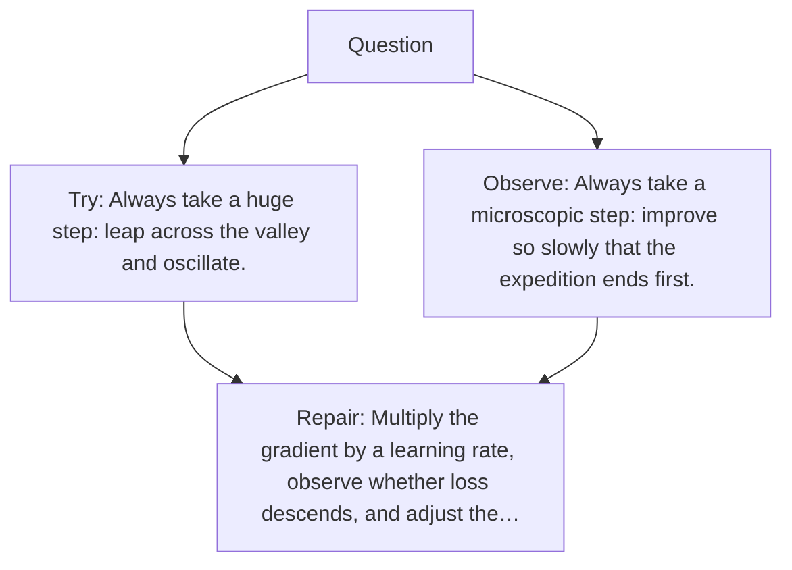

# Diagram — Excavation 027 — Learning Rate — How Large Should the Next Step Be?

The picture carries this excavation's particular counterexample and repair.



```text
TRY     Always take a huge step: leap across the valley and oscillate.
BREAK   Always take a microscopic step: improve so slowly that the expedition ends first.
REPAIR  Multiply the gradient by a learning rate, observe whether loss descends, and adjust the…
```

<!-- memory-film-v1:start -->
## Five-frame memory film

```text
QUESTION       How Large Should the Next Step Be?
     ↓
OBJECT         the learning rate wheel mounted on the ring of glass lanterns
     ↓
VISIBLE BREAK  The wheel follows the tempting path—always take a huge step: leap across the valley and oscillate. Then the evidence answers: always take a microscopic step: improve so slowly that the expedition ends first.
     ↓
TRANSFORMATION The keeper of uncertain stories changes one moving part. The wheel can now multiply the gradient by an adjustable positive step size, observe whether loss descends, and adjust that size over time.
     ↓
MEMORY SEAL    Learning Rate keeps the missing power: multiply the gradient by an adjustable positive step size, observe whether loss descends, and adjust that size over time.
```
<!-- memory-film-v1:end -->
