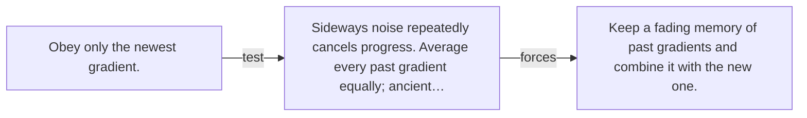

# Diagram — Excavation 028 — Momentum — Remembering Which Way Downhill Persists

The picture carries this excavation's particular counterexample and repair.



```text
TRY     Obey only the newest gradient.
BREAK   Sideways noise repeatedly cancels progress. Average every past gradient equally; ancient…
REPAIR  Keep a fading memory of past gradients and combine it with the new one.
```

<!-- memory-film-v1:start -->
## Five-frame memory film

```text
QUESTION       What fails if we obey only the newest gradient?
     ↓
OBJECT         the momentum map mounted on the ring of glass lanterns
     ↓
VISIBLE BREAK  The map follows the tempting path—obey only the newest gradient. Then the evidence answers: sideways noise repeatedly cancels progress. Average every past gradient equally; ancient advice remains influential after the landscape changes.
     ↓
TRANSFORMATION The keeper of uncertain stories changes one moving part. The map can now keep a fading memory of past gradients and combine it with the new one.
     ↓
MEMORY SEAL    Momentum keeps the missing power: keep a fading memory of past gradients and combine it with the new one.
```
<!-- memory-film-v1:end -->
