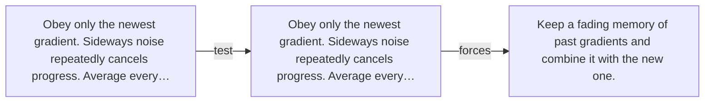

# Diagram — Excavation 028 — Momentum — Remembering Which Way Downhill Persists

The picture carries this excavation's particular counterexample and repair.



```text
TRY     Obey only the newest gradient. Sideways noise repeatedly cancels progress. Average every…
BREAK   Obey only the newest gradient. Sideways noise repeatedly cancels progress. Average every…
REPAIR  Keep a fading memory of past gradients and combine it with the new one.
```
