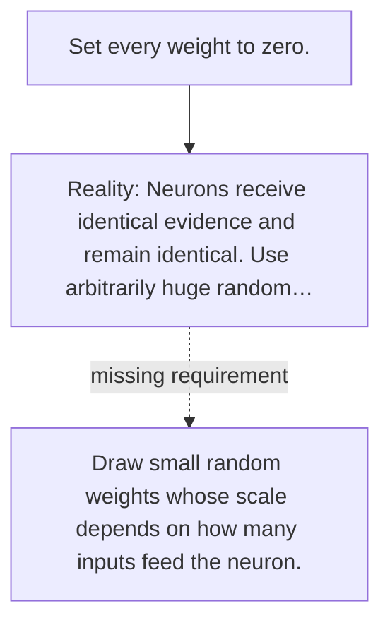

# Diagram — Excavation 029 — Initialization — Where Should Learning Begin?

The picture carries this excavation's particular counterexample and repair.



```text
TRY     Set every weight to zero.
BREAK   Neurons receive identical evidence and remain identical. Use arbitrarily huge random…
REPAIR  Draw small random weights whose scale depends on how many inputs feed the neuron.
```
