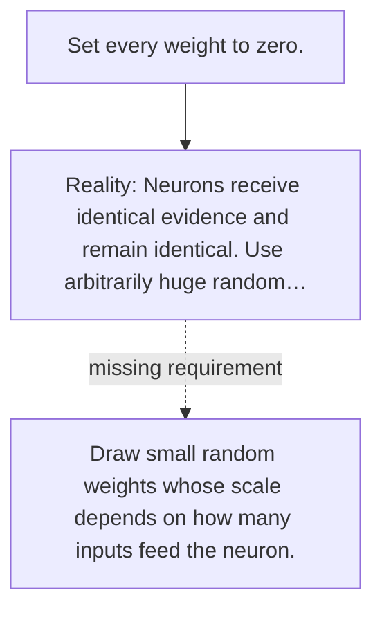

# Diagram — Excavation 029 — Initialization — Where Should Learning Begin?

The picture carries this excavation's particular counterexample and repair.



```text
TRY     Set every weight to zero.
BREAK   Neurons receive identical evidence and remain identical. Use arbitrarily huge random…
REPAIR  Draw small random weights whose scale depends on how many inputs feed the neuron.
```

<!-- memory-film-v1:start -->
## Five-frame memory film

```text
QUESTION       Where Should Learning Begin?
     ↓
OBJECT         the initialization scale mounted on the ring of glass lanterns
     ↓
VISIBLE BREAK  The scale follows the tempting path—set every weight to zero. Then the evidence answers: neurons receive identical evidence and remain identical. Use arbitrarily huge random values. Signals explode or gates saturate.
     ↓
TRANSFORMATION The keeper of uncertain stories changes one moving part. The scale can now draw small random weights whose scale depends on how many inputs feed the neuron.
     ↓
MEMORY SEAL    Initialization keeps the missing power: draw small random weights whose scale depends on how many inputs feed the neuron.
```
<!-- memory-film-v1:end -->
