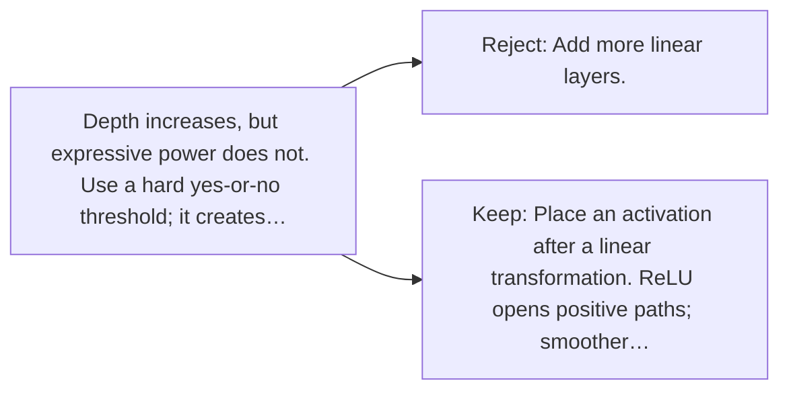

# Diagram — Excavation 030 — Activation Functions — Why a Network Must Bend

The picture carries this excavation's particular counterexample and repair.



```text
TRY     Add more linear layers.
BREAK   Depth increases, but expressive power does not. Use a hard yes-or-no threshold; it creates…
REPAIR  Place an activation after a linear transformation. ReLU opens positive paths; smoother…
```
