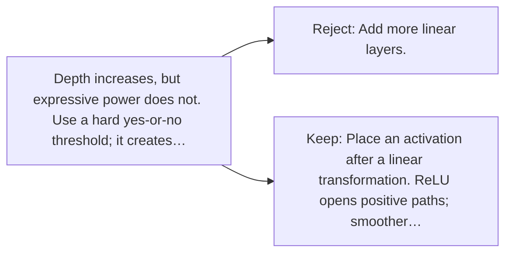

# Diagram — Excavation 030 — Activation Functions — Why a Network Must Bend

The picture carries this excavation's particular counterexample and repair.



```text
TRY     Add more linear layers.
BREAK   Depth increases, but expressive power does not. Use a hard yes-or-no threshold; it creates…
REPAIR  Place an activation after a linear transformation. ReLU opens positive paths; smoother…
```

<!-- memory-film-v1:start -->
## Five-frame memory film

```text
QUESTION       Why a Network Must Bend?
     ↓
OBJECT         the activation functions gear mounted on the ring of glass lanterns
     ↓
VISIBLE BREAK  The gear follows the tempting path—add more linear layers. Then the evidence answers: depth increases, but expressive power does not. Use a hard yes-or-no threshold; it creates decisions but supplies almost no useful gradient.
     ↓
TRANSFORMATION The keeper of uncertain stories changes one moving part. The gear can now place an activation after a linear transformation. ReLU opens positive paths; smoother gates such as GELU vary them gradually.
     ↓
MEMORY SEAL    Activation Functions keeps the missing power: place an activation after a linear transformation. ReLU opens positive paths; smoother gates such as GELU vary them gradually.
```
<!-- memory-film-v1:end -->
