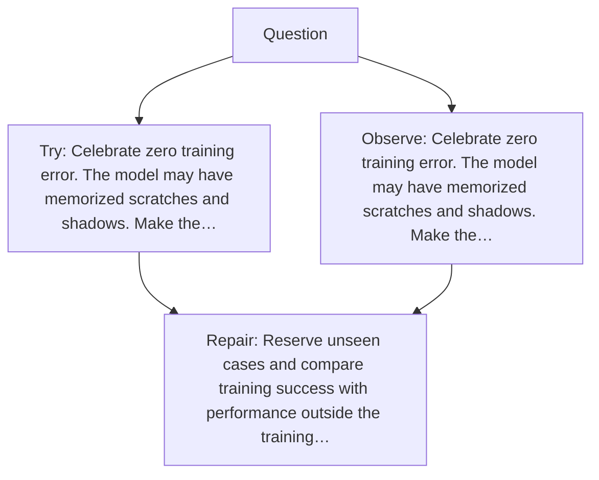

# Diagram — Excavation 031 — Overfitting — When Perfect Memory Pretends to Be Intelligence

The picture carries this excavation's particular counterexample and repair.



```text
TRY     Celebrate zero training error. The model may have memorized scratches and shadows. Make the…
BREAK   Celebrate zero training error. The model may have memorized scratches and shadows. Make the…
REPAIR  Reserve unseen cases and compare training success with performance outside the training…
```
