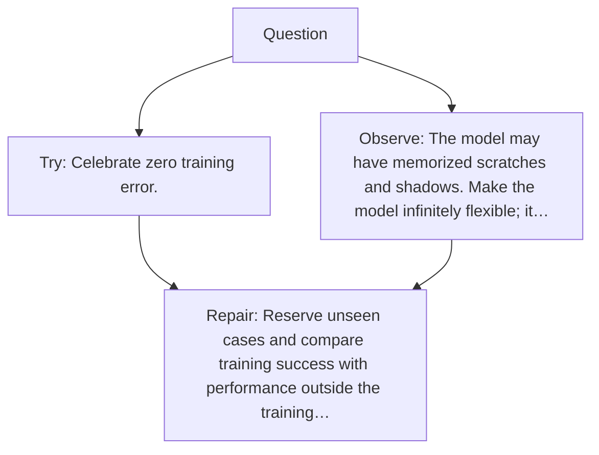

# Diagram — Excavation 031 — Overfitting — When Perfect Memory Pretends to Be Intelligence

The picture carries this excavation's particular counterexample and repair.



```text
TRY     Celebrate zero training error.
BREAK   The model may have memorized scratches and shadows. Make the model infinitely flexible; it…
REPAIR  Reserve unseen cases and compare training success with performance outside the training…
```

<!-- memory-film-v1:start -->
## Five-frame memory film

```text
QUESTION       When Perfect Memory Pretends to Be Intelligence?
     ↓
OBJECT         the overfitting prism mounted on the ring of glass lanterns
     ↓
VISIBLE BREAK  The prism follows the tempting path—celebrate zero training error. Then the evidence answers: the model may have memorized scratches and shadows. Make the model infinitely flexible; it can store even more irrelevant detail.
     ↓
TRANSFORMATION The keeper of uncertain stories changes one moving part. The prism can now reserve unseen cases and compare training success with performance outside the training memory.
     ↓
MEMORY SEAL    Overfitting keeps the missing power: reserve unseen cases and compare training success with performance outside the training memory.
```
<!-- memory-film-v1:end -->
