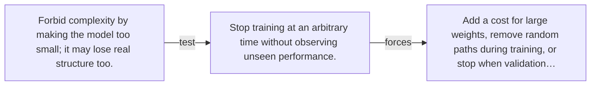

# Diagram — Excavation 032 — Regularization — Making Memorization More Expensive

The picture carries this excavation's particular counterexample and repair.



```text
TRY     Forbid complexity by making the model too small; it may lose real structure too.
BREAK   Stop training at an arbitrary time without observing unseen performance.
REPAIR  Add a cost for large weights, remove random paths during training, or stop when validation…
```

<!-- memory-film-v1:start -->
## Five-frame memory film

```text
QUESTION       What fails if we forbid complexity by making the model too small; it may lose real structure too?
     ↓
OBJECT         the regularization seal mounted on the ring of glass lanterns
     ↓
VISIBLE BREAK  The seal follows the tempting path—forbid complexity by making the model too small; it may lose real structure too. Then the evidence answers: stop training at an arbitrary time without observing unseen performance.
     ↓
TRANSFORMATION The keeper of uncertain stories changes one moving part. The seal can now add a cost for large weights, remove random paths during training, or stop when validation performance stops improving.
     ↓
MEMORY SEAL    Regularization keeps the missing power: add a cost for large weights, remove random paths during training, or stop when validation performance stops improving.
```
<!-- memory-film-v1:end -->
