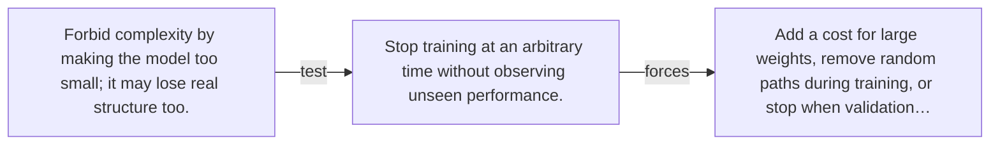

# Diagram — Excavation 032 — Regularization — Making Memorization More Expensive

The picture carries this excavation's particular counterexample and repair.



```text
TRY     Forbid complexity by making the model too small; it may lose real structure too.
BREAK   Stop training at an arbitrary time without observing unseen performance.
REPAIR  Add a cost for large weights, remove random paths during training, or stop when validation…
```
