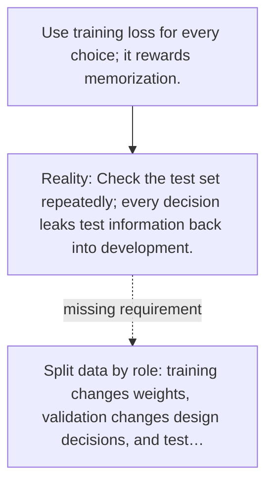

# Diagram — Excavation 033 — Validation — Testing Without Peeking at the Final Exam

The picture carries this excavation's particular counterexample and repair.



```text
TRY     Use training loss for every choice; it rewards memorization.
BREAK   Check the test set repeatedly; every decision leaks test information back into development.
REPAIR  Split data by role: training changes weights, validation changes design decisions, and test…
```
