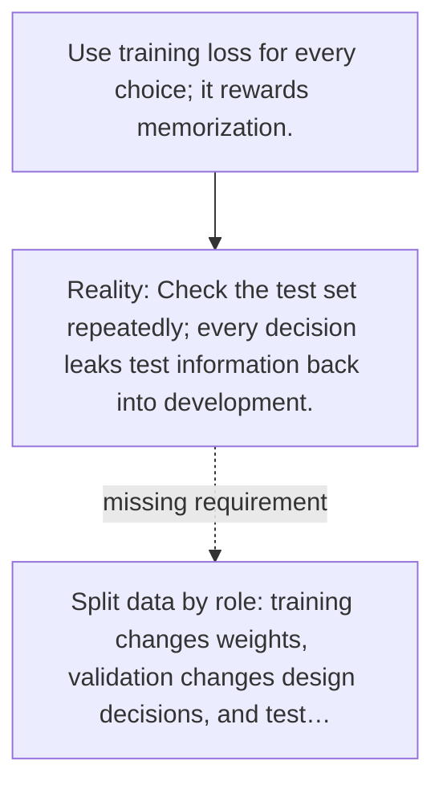

# Diagram — Excavation 033 — Validation — Testing Without Peeking at the Final Exam

The picture carries this excavation's particular counterexample and repair.



```text
TRY     Use training loss for every choice; it rewards memorization.
BREAK   Check the test set repeatedly; every decision leaks test information back into development.
REPAIR  Split data by role: training changes weights, validation changes design decisions, and test…
```

<!-- memory-film-v1:start -->
## Five-frame memory film

```text
QUESTION       What fails if we use training loss for every choice; it rewards memorization?
     ↓
OBJECT         the validation lens mounted on the ring of glass lanterns
     ↓
VISIBLE BREAK  The lens follows the tempting path—use training loss for every choice; it rewards memorization. Then the evidence answers: check the test set repeatedly; every decision leaks test information back into development.
     ↓
TRANSFORMATION The keeper of uncertain stories changes one moving part. The lens can now split data by role: training changes weights, validation changes design decisions, and test data is opened once at the end.
     ↓
MEMORY SEAL    Validation keeps the missing power: split data by role: training changes weights, validation changes design decisions, and test data is opened once at the end.
```
<!-- memory-film-v1:end -->
