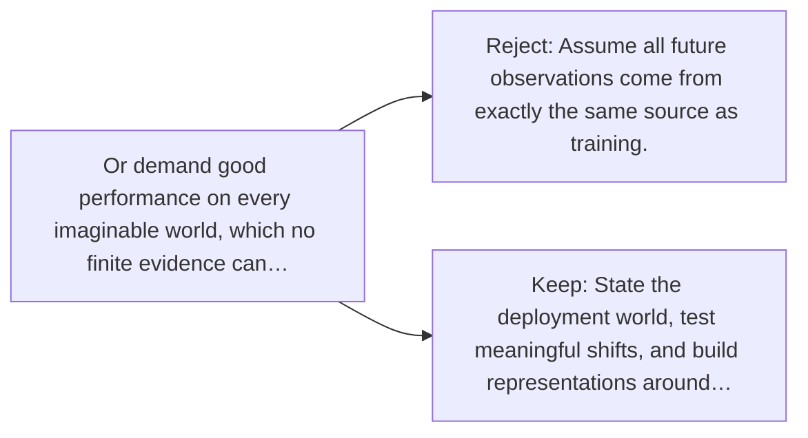

# Diagram — Excavation 034 — Generalization — What Should Survive Beyond the Dataset?

The picture carries this excavation's particular counterexample and repair.



```text
TRY     Assume all future observations come from exactly the same source as training.
BREAK   Or demand good performance on every imaginable world, which no finite evidence can…
REPAIR  State the deployment world, test meaningful shifts, and build representations around…
```

<!-- memory-film-v1:start -->
## Five-frame memory film

```text
QUESTION       What Should Survive Beyond the Dataset?
     ↓
OBJECT         the generalization key mounted on the ring of glass lanterns
     ↓
VISIBLE BREAK  The key follows the tempting path—assume all future observations come from exactly the same source as training. Then the evidence answers: or demand good performance on every imaginable world, which no finite evidence can guarantee.
     ↓
TRANSFORMATION The keeper of uncertain stories changes one moving part. The key can now state the deployment world, test meaningful shifts, and build representations around relationships likely to survive those shifts.
     ↓
MEMORY SEAL    Generalization keeps the missing power: state the deployment world, test meaningful shifts, and build representations around relationships likely to survive those shifts.
```
<!-- memory-film-v1:end -->
