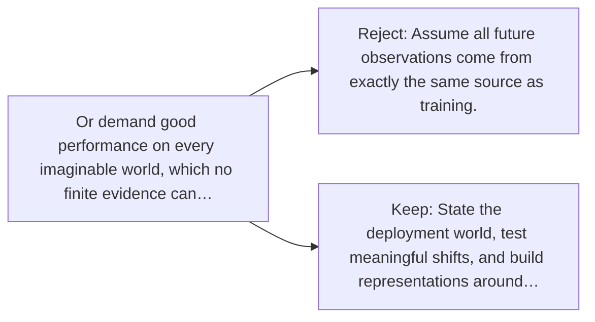

# Diagram — Excavation 034 — Generalization — What Should Survive Beyond the Dataset?

The picture carries this excavation's particular counterexample and repair.



```text
TRY     Assume all future observations come from exactly the same source as training.
BREAK   Or demand good performance on every imaginable world, which no finite evidence can…
REPAIR  State the deployment world, test meaningful shifts, and build representations around…
```
