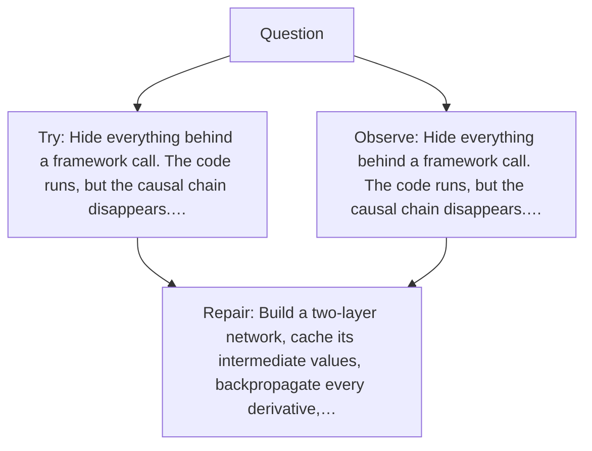

# Diagram — Excavation 035 — A Tiny Neural Network — Assemble the Entire Learning Loop

The picture carries this excavation's particular counterexample and repair.



```text
TRY     Hide everything behind a framework call. The code runs, but the causal chain disappears.…
BREAK   Hide everything behind a framework call. The code runs, but the causal chain disappears.…
REPAIR  Build a two-layer network, cache its intermediate values, backpropagate every derivative,…
```
