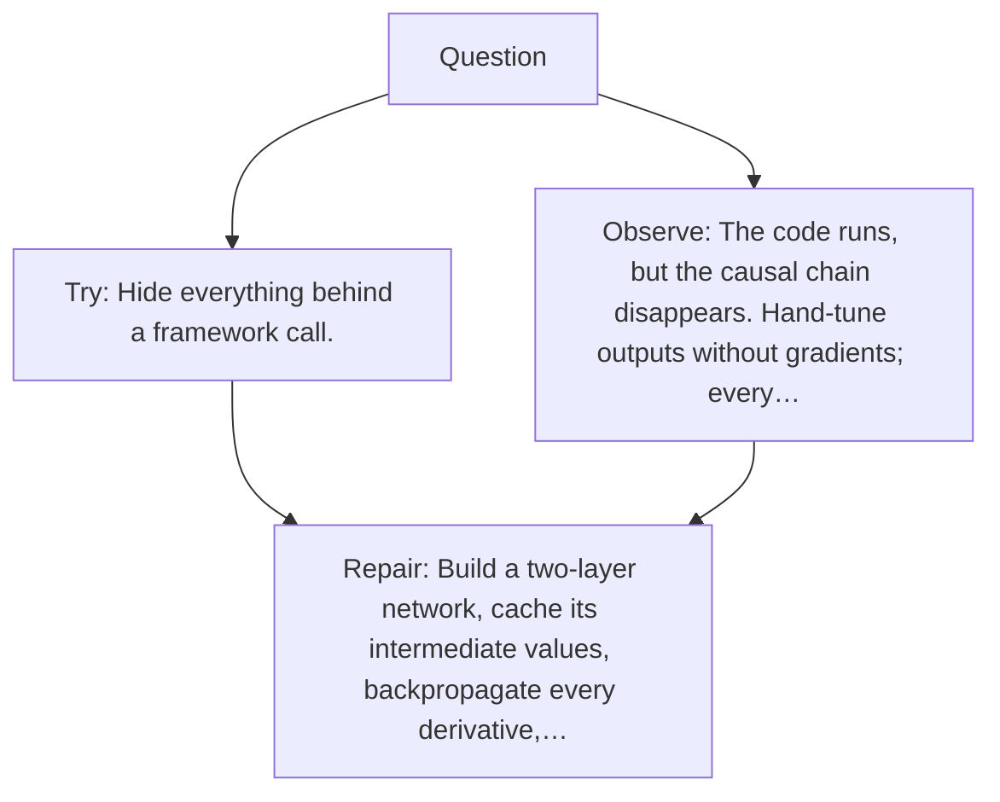

# Diagram — Excavation 035 — A Tiny Neural Network — Assemble the Entire Learning Loop

The picture carries this excavation's particular counterexample and repair.



```text
TRY     Hide everything behind a framework call.
BREAK   The code runs, but the causal chain disappears. Hand-tune outputs without gradients; every…
REPAIR  Build a two-layer network, cache its intermediate values, backpropagate every derivative,…
```

<!-- memory-film-v1:start -->
## Five-frame memory film

```text
QUESTION       What fails if we hide everything behind a framework call?
     ↓
OBJECT         the tiny neural network lantern mounted on the ring of glass lanterns
     ↓
VISIBLE BREAK  The lantern follows the tempting path—hide everything behind a framework call. Then the evidence answers: the code runs, but the causal chain disappears. Hand-tune outputs without gradients; every new example breaks the tuning.
     ↓
TRANSFORMATION The keeper of uncertain stories changes one moving part. The lantern can now build a two-layer network, cache its intermediate values, backpropagate every derivative, update on batches, and evaluate on unseen data.
     ↓
MEMORY SEAL    A Tiny Neural Network keeps the missing power: build a two-layer network, cache its intermediate values, backpropagate every derivative, update on batches, and evaluate on unseen data.
```
<!-- memory-film-v1:end -->
