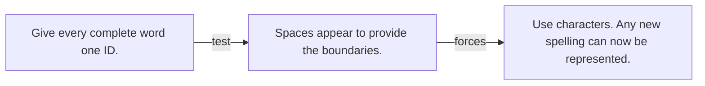

# Diagram — Excavation 036 — Tokenization: What Can a Language Model See?

The picture carries this excavation's particular counterexample and repair.



```text
TRY     Give every complete word one ID.
BREAK   Spaces appear to provide the boundaries.
REPAIR  Use characters. Any new spelling can now be represented.
```
