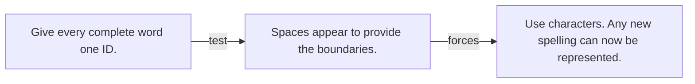

# Diagram — Excavation 036 — Tokenization: What Can a Language Model See?

The picture carries this excavation's particular counterexample and repair.



```text
TRY     Give every complete word one ID.
BREAK   Spaces appear to provide the boundaries.
REPAIR  Use characters. Any new spelling can now be represented.
```

<!-- memory-film-v1:start -->
## Five-frame memory film

```text
QUESTION       What Can a Language Model See?
     ↓
OBJECT         the tokenization compass mounted on the sentence-wheel
     ↓
VISIBLE BREAK  The compass follows the tempting path—give every complete word one ID. Then the evidence answers: spaces appear to provide the boundaries.
     ↓
TRANSFORMATION The mechanist changes one moving part. The compass can now use characters. Any new spelling can now be represented.
     ↓
MEMORY SEAL    Tokenization keeps the missing power: use characters. Any new spelling can now be represented.
```
<!-- memory-film-v1:end -->
