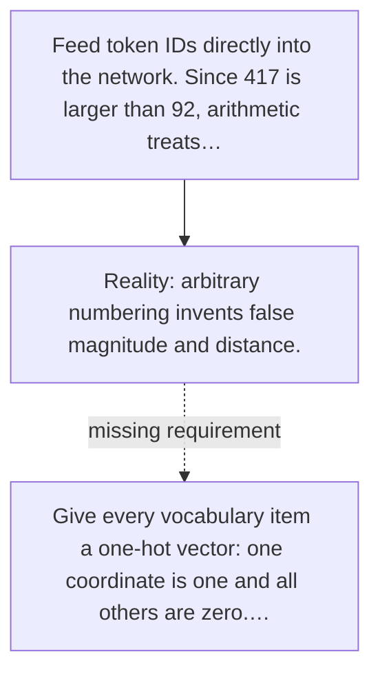

# Diagram — Excavation 037 — Input Embeddings: Giving Tokens Learnable Coordinates

The picture carries this excavation's particular counterexample and repair.



```text
TRY     Feed token IDs directly into the network. Since 417 is larger than 92, arithmetic treats…
BREAK   arbitrary numbering invents false magnitude and distance.
REPAIR  Give every vocabulary item a one-hot vector: one coordinate is one and all others are zero.…
```
