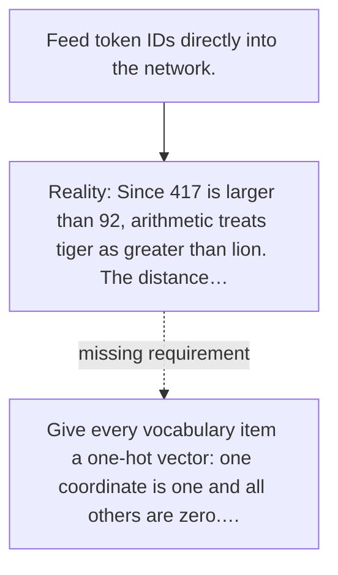

# Diagram — Excavation 037 — Input Embeddings: Giving Tokens Learnable Coordinates

The picture carries this excavation's particular counterexample and repair.



```text
TRY     Feed token IDs directly into the network.
BREAK   Since 417 is larger than 92, arithmetic treats tiger as greater than lion. The distance…
REPAIR  Give every vocabulary item a one-hot vector: one coordinate is one and all others are zero.…
```

<!-- memory-film-v1:start -->
## Five-frame memory film

```text
QUESTION       What fails if we feed token IDs directly into the network?
     ↓
OBJECT         the input embeddings bridge mounted on the sentence-wheel
     ↓
VISIBLE BREAK  The bridge follows the tempting path—feed token IDs directly into the network. Then the evidence answers: since 417 is larger than 92, arithmetic treats tiger as greater than lion. The distance from tiger to lion becomes 325, while the distance from tiger to token 418 is one.
     ↓
TRANSFORMATION The mechanist changes one moving part. The bridge can now give every vocabulary item a one-hot vector: one coordinate is one and all others are zero. `lion → [1, 0, 0, 0]`, `tiger → [0, 1, 0, 0]`, and `river → [0, 0, 1, 0]`. Now IDs no longer pretend to contain magnitude.
     ↓
MEMORY SEAL    Input Embeddings keeps the missing power: give every vocabulary item a one-hot vector: one coordinate is one and all others are zero. `lion → [1, 0, 0, 0]`, `tiger → [0, 1, 0, 0]`, and `river → [0, 0, 1, 0]`. Now IDs no longer pretend to contain magnitude.
```
<!-- memory-film-v1:end -->
