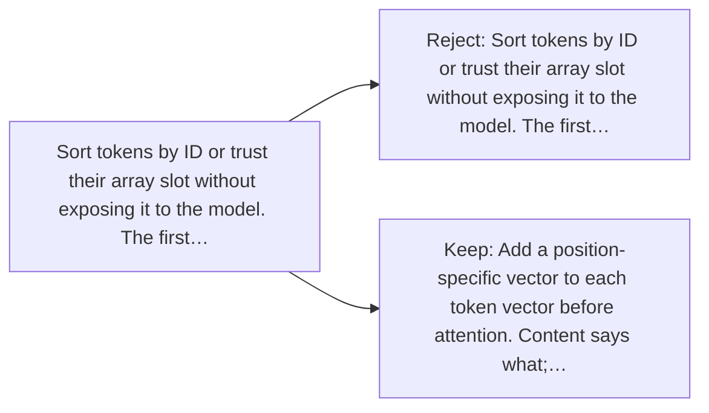

# Diagram — Excavation 038 — Position — Why Order Must Enter the Model

The picture carries this excavation's particular counterexample and repair.



```text
TRY     Sort tokens by ID or trust their array slot without exposing it to the model. The first…
BREAK   Sort tokens by ID or trust their array slot without exposing it to the model. The first…
REPAIR  Add a position-specific vector to each token vector before attention. Content says what;…
```
