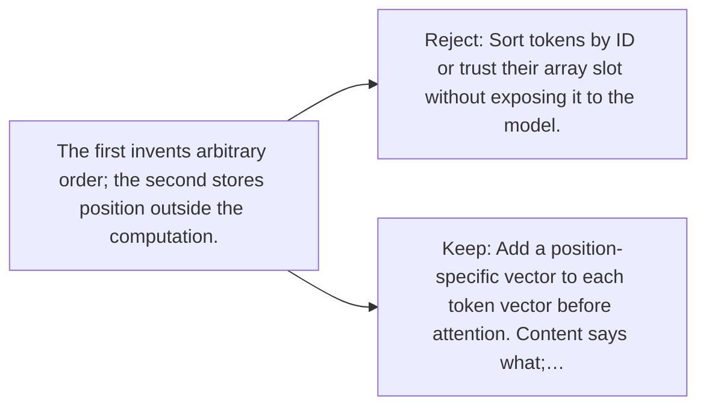

# Diagram — Excavation 038 — Position — Why Order Must Enter the Model

The picture carries this excavation's particular counterexample and repair.



```text
TRY     Sort tokens by ID or trust their array slot without exposing it to the model.
BREAK   The first invents arbitrary order; the second stores position outside the computation.
REPAIR  Add a position-specific vector to each token vector before attention. Content says what;…
```

<!-- memory-film-v1:start -->
## Five-frame memory film

```text
QUESTION       Why Order Must Enter the Model?
     ↓
OBJECT         the position thread mounted on the sentence-wheel
     ↓
VISIBLE BREAK  The thread follows the tempting path—sort tokens by ID or trust their array slot without exposing it to the model. Then the evidence answers: the first invents arbitrary order; the second stores position outside the computation.
     ↓
TRANSFORMATION The mechanist changes one moving part. The thread can now add a position-specific vector to each token vector before attention. Content says what; position says where.
     ↓
MEMORY SEAL    Position keeps the missing power: add a position-specific vector to each token vector before attention. Content says what; position says where.
```
<!-- memory-film-v1:end -->
