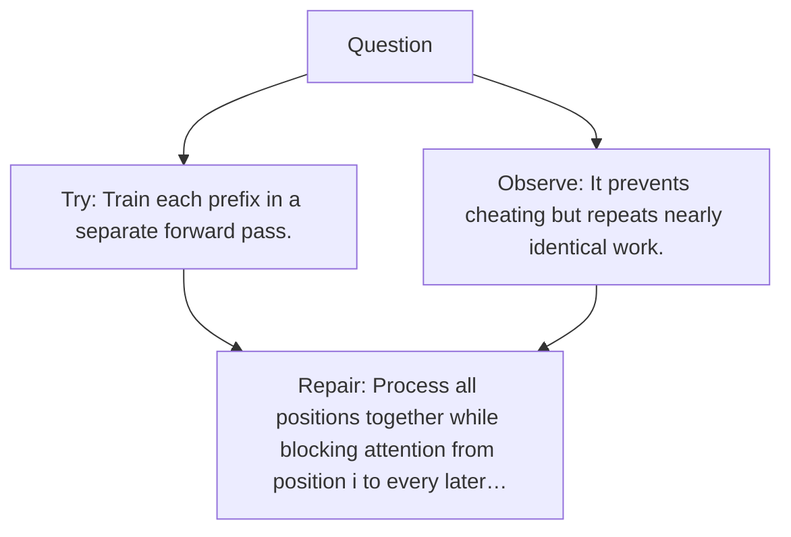

# Diagram — Excavation 039 — Causal Masking — Preventing the Future from Leaking Backward

The picture carries this excavation's particular counterexample and repair.



```text
TRY     Train each prefix in a separate forward pass.
BREAK   It prevents cheating but repeats nearly identical work.
REPAIR  Process all positions together while blocking attention from position i to every later…
```

<!-- memory-film-v1:start -->
## Five-frame memory film

```text
QUESTION       What fails if we train each prefix in a separate forward pass?
     ↓
OBJECT         the causal masking mirror mounted on the sentence-wheel
     ↓
VISIBLE BREAK  The mirror follows the tempting path—train each prefix in a separate forward pass. Then the evidence answers: it prevents cheating but repeats nearly identical work.
     ↓
TRANSFORMATION The mechanist changes one moving part. The mirror can now process all positions together while blocking attention from position i to every later position j.
     ↓
MEMORY SEAL    Causal Masking keeps the missing power: process all positions together while blocking attention from position i to every later position j.
```
<!-- memory-film-v1:end -->
