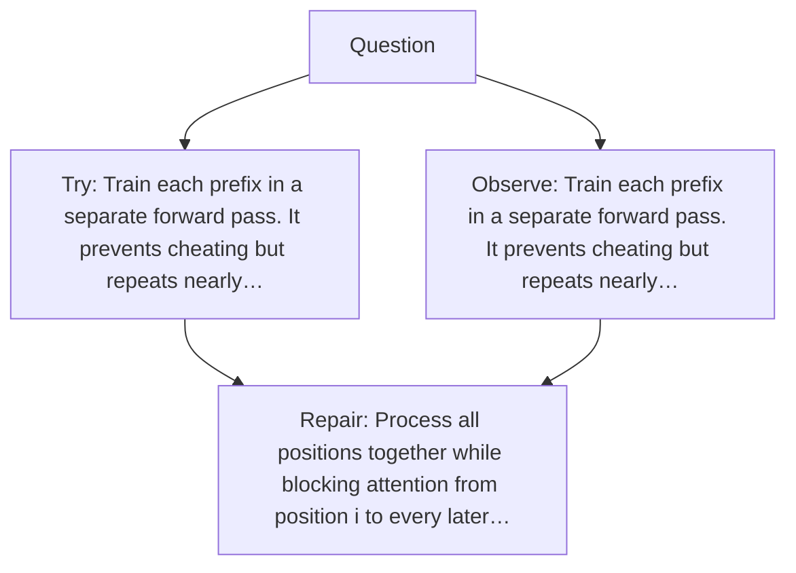

# Diagram — Excavation 039 — Causal Masking — Preventing the Future from Leaking Backward

The picture carries this excavation's particular counterexample and repair.



```text
TRY     Train each prefix in a separate forward pass. It prevents cheating but repeats nearly…
BREAK   Train each prefix in a separate forward pass. It prevents cheating but repeats nearly…
REPAIR  Process all positions together while blocking attention from position i to every later…
```
