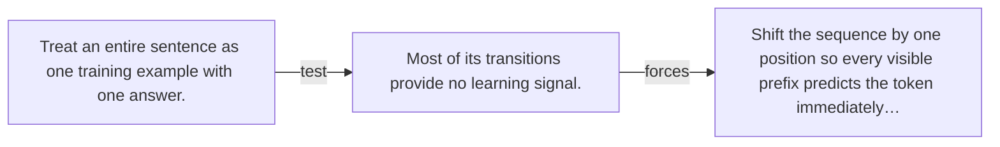

# Diagram — Excavation 040 — Next-Token Examples — One Sentence Becomes Many Lessons

The picture carries this excavation's particular counterexample and repair.



```text
TRY     Treat an entire sentence as one training example with one answer.
BREAK   Most of its transitions provide no learning signal.
REPAIR  Shift the sequence by one position so every visible prefix predicts the token immediately…
```
