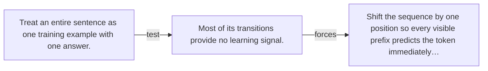

# Diagram — Excavation 040 — Next-Token Examples — One Sentence Becomes Many Lessons

The picture carries this excavation's particular counterexample and repair.



```text
TRY     Treat an entire sentence as one training example with one answer.
BREAK   Most of its transitions provide no learning signal.
REPAIR  Shift the sequence by one position so every visible prefix predicts the token immediately…
```

<!-- memory-film-v1:start -->
## Five-frame memory film

```text
QUESTION       What fails if we treat an entire sentence as one training example with one answer?
     ↓
OBJECT         the next-token examples bell mounted on the sentence-wheel
     ↓
VISIBLE BREAK  The bell follows the tempting path—treat an entire sentence as one training example with one answer. Then the evidence answers: most of its transitions provide no learning signal.
     ↓
TRANSFORMATION The mechanist changes one moving part. The bell can now shift the sequence by one position so every visible prefix predicts the token immediately following it.
     ↓
MEMORY SEAL    Next-Token Examples keeps the missing power: shift the sequence by one position so every visible prefix predicts the token immediately following it.
```
<!-- memory-film-v1:end -->
