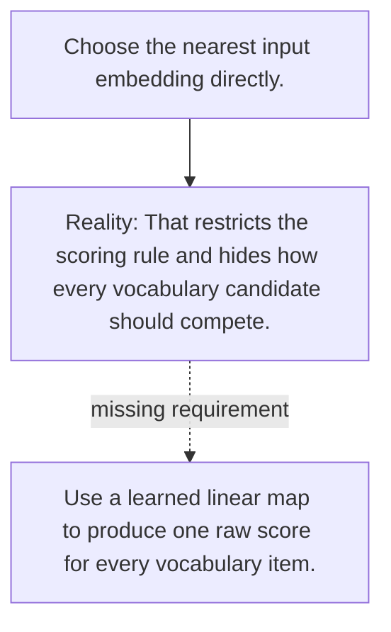

# Diagram — Excavation 041 — Logits — Let Every Vocabulary Token Compete

The picture carries this excavation's particular counterexample and repair.



```text
TRY     Choose the nearest input embedding directly.
BREAK   That restricts the scoring rule and hides how every vocabulary candidate should compete.
REPAIR  Use a learned linear map to produce one raw score for every vocabulary item.
```

<!-- memory-film-v1:start -->
## Five-frame memory film

```text
QUESTION       What fails if we choose the nearest input embedding directly?
     ↓
OBJECT         the logits vessel mounted on the sentence-wheel
     ↓
VISIBLE BREAK  The vessel follows the tempting path—choose the nearest input embedding directly. Then the evidence answers: that restricts the scoring rule and hides how every vocabulary candidate should compete.
     ↓
TRANSFORMATION The mechanist changes one moving part. The vessel can now use a learned linear map to produce one raw score for every vocabulary item.
     ↓
MEMORY SEAL    Logits keeps the missing power: use a learned linear map to produce one raw score for every vocabulary item.
```
<!-- memory-film-v1:end -->
