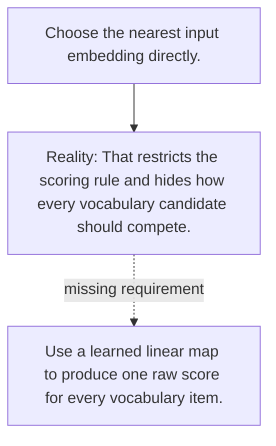

# Diagram — Excavation 041 — Logits — Let Every Vocabulary Token Compete

The picture carries this excavation's particular counterexample and repair.



```text
TRY     Choose the nearest input embedding directly.
BREAK   That restricts the scoring rule and hides how every vocabulary candidate should compete.
REPAIR  Use a learned linear map to produce one raw score for every vocabulary item.
```
